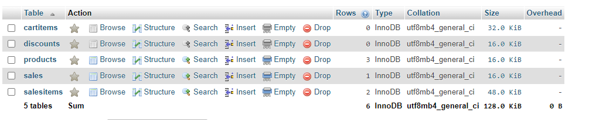
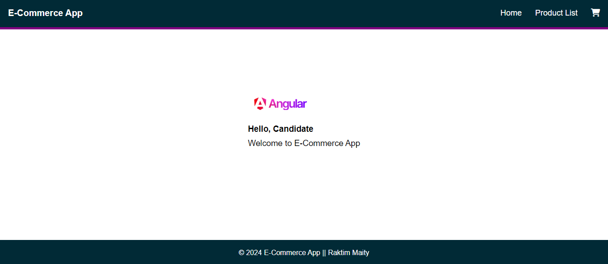
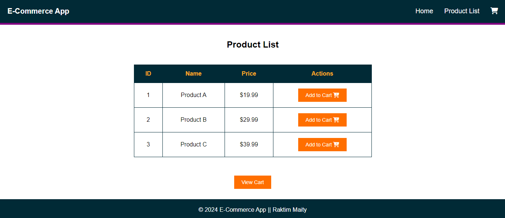
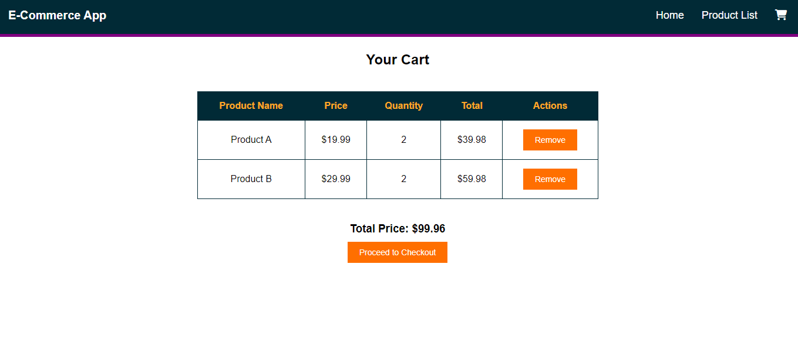
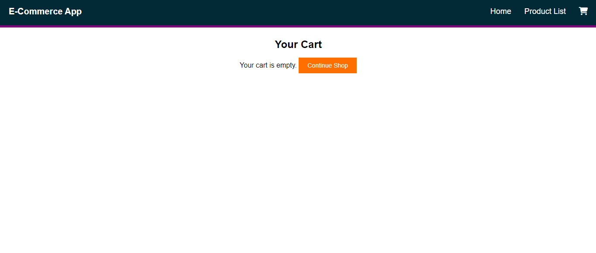

# Ecommerce Website

### Here i used PHP and MySQL databse.

## Key features
Here, are some key feature:
- Add to Cart
- Remove from Cart

## 1. DataBase Connection


## 2. Connect to the database
``` <?php
$servername = "localhost";
$username = "root";
$password = "";
$dbname = "ecommerce_db";

$conn = mysqli_connect($servername, $username, $password, $dbname);

 ```
## 3. Create `index.php` file
## 4. Create `header.php` file
## 5. Create `footer.php` file

# Screenshots
### Main Page


### Product List Page


### Cart Page

<br>
You can remove from cart options

### Cart Page

<br>
If the cart list is empty

### Proceed to payment


## Authors

- [Raktim Maity](https://github.com/Raktimmaity)
